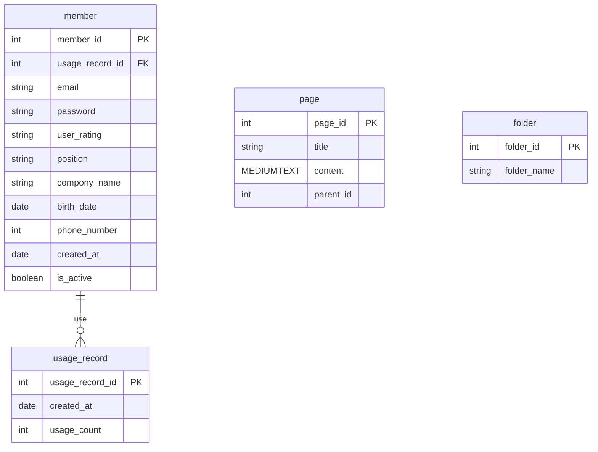

---
title: MongoDB
---

```json
{
  "project": {
    "project_id": 1,
    "directory": [
      {
        "directory_id": 1,
        "directory": [
          {
            
          }
        ],
        "file": [
          {
            "file_id": 1,
            "file_name": "sdf",
            "file_content": ""
          }
        ]
      }
    ]
  }
}
```
